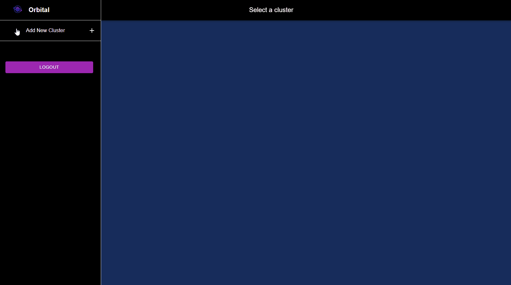
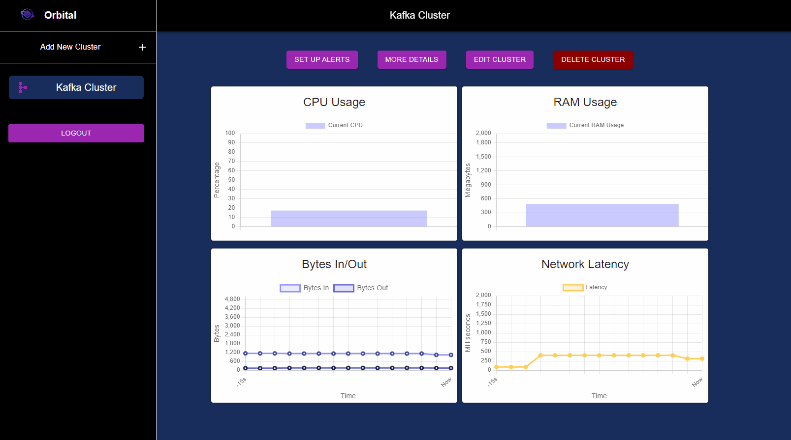
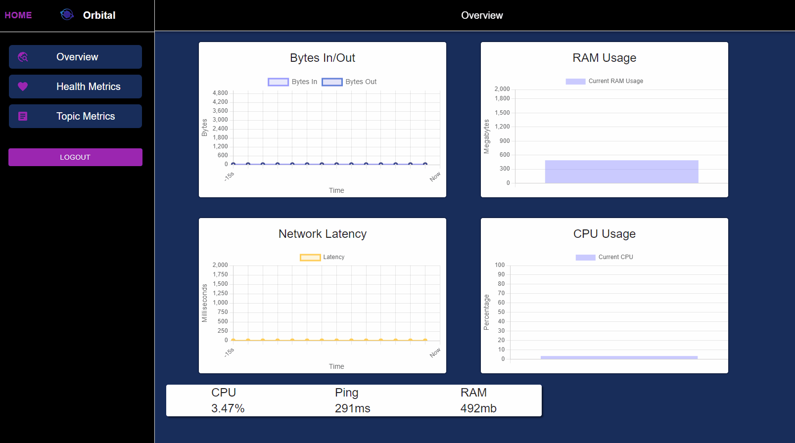

# Orbital
### Orbital is an open-source tool for visualizing and monitoring Kafka clusters. It is designed to help developers save time and improve efficiency by providing a real-time view of their Kafka clusters.

## How Orbital Can Help You

Orbital is designed to help developers save time and improve efficiency by providing a real-time view of their Kafka clusters. With Orbital, you can:
- Identify potential issues before they become major problems
- Monitor key metrics to ensure optimal performance
- Customize your dashboards to display the information that matters to your org
- Receive alerts and notifications when issues arise
- Provides relevant and useful graphs that update in real-time -- with no additional configuration required
- Presents topics and partitions in a user-friendly visualization for making swift optimization decisions related to consumer performance
- Removes the requirement of manually creating PromQL queries and using unfamiliar CLI commands

## Getting Started

To use this application, follow these instructions:

1. Head over to orbital-view.com
2. Create an account
3. Enter your public Prometheus port
4. Have fun with Orbital!

## Features

Orbital enables you to view your cluster information in the following ways using an interactive GUI:

**1) View Cluster Health Metrics (with Prometheus Connection)** 

Users can view the overall health of their cluster at a glance on the 'Health Metrics' page which includes auto-updating graphs displaying real-time data readings for CPU Usage, RAM usage, Bytes In and Out, and Network Latency.

**2) View Key Insights into Cluster Producer & Consumers (with Prometheus connection)**

The 'More Details' page allows users to gain key insights into the Producers and Consumers of their Kafka Cluster, including the number of messages produced and consumed, any failed requests, and conversion data. This allows developers to quickly make optimization decisions about producer and consumer assignments.

**3) View Data at Topic-Level for Top 5 Most Used Topics (with Prometheus Connection)**

The 'Topic Metrics' page displays metrics for the most active Cluster topics. Developers can view their top 5 cluster topics, their partitions, and consumer offsets. Click on each topic section to expand and view graphs displaying throughput information at the topic level and click again to collapse.

## Built With
- [React](https://reactjs.org/) - Frontend Framework
- [Material UI](https://mui.com/) - Design Framework
- [ChartJS](https://www.chartjs.org/) - Rendering of metric graphs
- [Node.js](https://nodejs.org/en/) - File system, testing, core application functionality
- [Express](https://expressjs.com/) - Backend Framework
- [MongoDB](https://www.mongodb.com/) - Non-relational database for user accounts and cluster info
- [KafkaJS](https://kafka.js.org/) - Kafka client for Node.js
- [Prometheus](https://prometheus.io/) - Time series database with event monitoring
- [Docker](https://www.docker.com/) - Containerization
- [AWS](https://aws.amazon.com/) - Cloud-computing services

## Contributors

[Victor Gulyak](https://github.com/vicg932) - [LinkedIn](https://www.linkedin.com/in/vic-gul/)
 
[Sidney Brodsky](https://github.com/SidneyJB) - [LinkedIn](https://www.linkedin.com/in/sidney-brodsky/)
 
[Kirill Karbutov](https://github.com/Karbutov00) - [LinkedIn](https://www.linkedin.com/in/kirill-karbutov/)
 
[Slava Melikov](https://github.com/Slavamelikov05) - [LinkedIn](https://www.linkedin.com/in/slava-melikov/)
 

If you'd like to support the active development of Orbital:

- Star this repo!
- Write a review or tutorial on Mediumor a personal blog
- Contribute to this project by raising a new issue or making a PR to solve an issue
